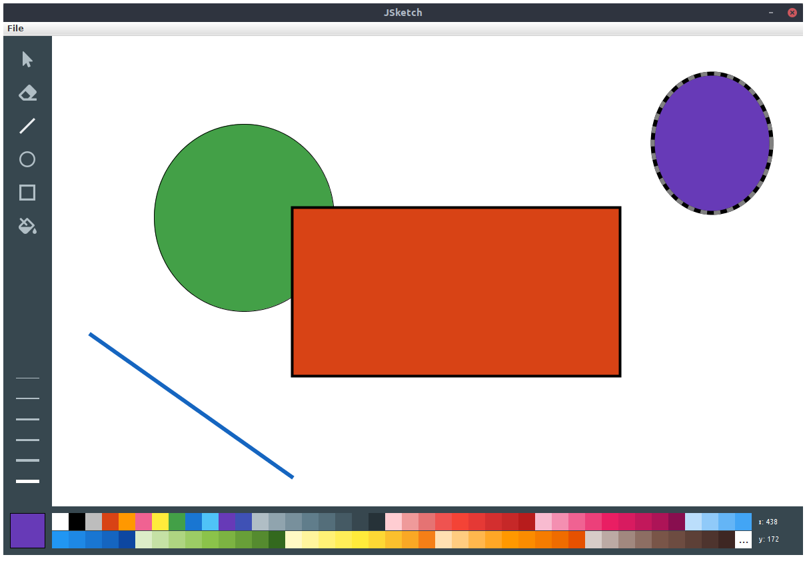

# JSketch
Created by Mohammed Nafees (mnafees)



JSketch is a vector-drawing program written in Java with Swing widgets. *Built on Ubuntu 18.04. Tested on Ubuntu 18.04, Windows 10 and macOS*.

## Features

- The application window is fixed at 1200px x 800px.
- You can save and load JSketch files. JSketch files are simple XML files with a `.jsketch` extension. *Using XML means that the file is highly portable from one paint program to another, when possible*.
- You can copy the current canvas with the shapes in it to your system clipboard and paste in a compatible program like PowerPoint, Paint etc.
- The menu items are aware of the state of the canvas. For instance, the `New`, `Save` and the `Copy Canvas` menu items are *disabled when the canvas is empty*.
- The *menu items have shortcuts* attached to each of them which translate to *cross-platform* modifier keys. For example, to load a file, if we are on Linux or Windows then we press `Ctrl+L` but on macOS we press `Cmd+L`. The shortcuts are as follows:
  - New - `Ctrl+N` or `Cmd+N` (on macOS)
  - Load - `Ctrl+L` or `Cmd+L` (on macOS)
  - Save - `Ctrl+S` or `Cmd+S` (on macOS)
  - Copy Canvas - `Ctrl+C` or `Cmd+C` (on macOS)
  - Quit - `Ctrl+Q` or `Cmd+Q` (on macOS)
- There is a tool palette with intuitive indication of when a certain tool is in use.
- The line thickness palette follows the design of the tool palette and has options for widths from 1px to 6px.
- There is a current selected color indicator at the bottom-left corner of the application window.
- The color palette has a variety of colors starting with some of the basic colors and followed by a list of colors from Google's Material Design Color Palette and also contains a button to choose more colors via a color chooser dialog.
- The current x and y coordinates of the pointer in the canvas is also reported on the bottom right corner of the application window.
- The code is *well documented* with javadocs-style comments as well as the *different widgets/components are segregated in their own classes*.
- The application takes advantage of *event-driven programming* and has several event listener interfaces to notify widgets of certain actions happening.


## Project Structure

- `build/` contains the ZIP and TAR archives with the executable
- `docs/` contains the Javadocs for the source code
- `sample/` contains the sample file that can be used to check the loading capability
- `Ubuntu Font License.txt` contains the Ubuntu Font License


### Attributions

Cursor, fill bucket and eraser tool icons are from Font Awesome - https://fontawesome.com/license/free

The Ubuntu Font
```
Copyright 2010,2011 Canonical Ltd.

This Font Software is licensed under the Ubuntu Font Licence, Version
1.0.  https://launchpad.net/ubuntu-font-licence
```
