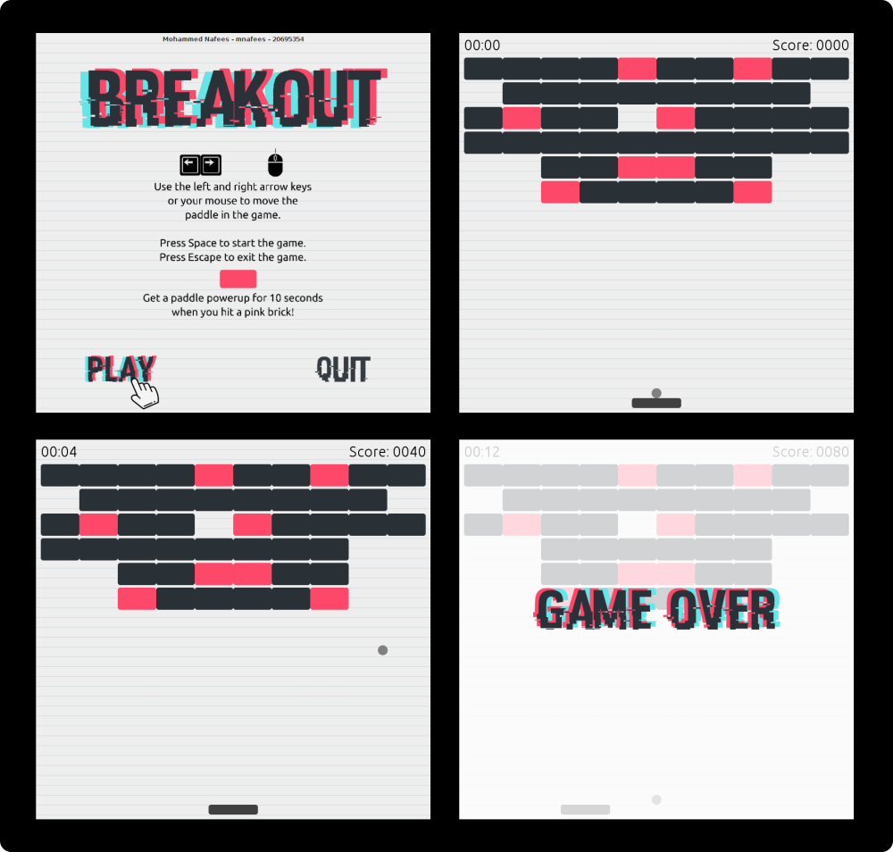

# Breakout
Created by Mohammed Nafees (mnafees)



Breakout is a 1976-era game originally created by Steve Wozniak of Apple Inc. **Built and tested on Ubuntu 18.04.**

## How to run

Breakout supports command line parameters. The help menu can be seen by using the `--help` or `-h` command line argument. The help options look like this:
```
USAGE: <executable> [OPTIONS]
OPTIONS:
  --fps          Any value from 24 to 60 (inclusive)
  --ballspeed    Any value from 1 to 5 (inclusive)
  --help, -h     Show this information
BALL SPEED INFO:
  1 represents VERY_SLOW
  2 represents SLOW
  3 represents MEDIUM (default)
  4 represents FAST");
  5 represents VERY_FAST
```

## Features

- Custom graphics and background music to make gameplay fun
- Built using the Model-View-Controller paradigm
- Supports variety of FPS measures as well as ball speeds
- **Has powerups during gameplay** to enhance the scoring
- Supports both mouse and keyboard to move the paddle in the game

## Project Structure

- `build/` contains the ZIP and TAR archives for the executable
- `docs/` contains the Javadocs for the source code
- `Scalr License.txt` contains the Apache 2.0 license for Scalr
- `Ubuntu Font License.txt` contains the Ubuntu Font License

### Attributions

#### Code

Breakout uses Scalr - github.com/rkalla/imgscalr. The Apache license is included for the same.

#### Font

The Ubuntu Font
```
Copyright 2010,2011 Canonical Ltd.

This Font Software is licensed under the Ubuntu Font Licence, Version
1.0.  https://launchpad.net/ubuntu-font-licence
```

#### Images and Icons

- Pointer icon by Freepik from www.flaticon.com/free-icon/pointer_178407 under Flaticon Basic License
- Right arrow key icon by Freepik from www.flaticon.com/free-icon/keyboard-key-pointing-to-right_30997 under Flaticon Basic License
- Left arrow key icon by Freepik from www.flaticon.com/free-icon/left-arrow-variant-key-on-keyboard_31931 under Flaticon Basic License
- Mouse icon by Kiranshastry from www.flaticon.com/free-icon/mouse_1904293 under Flaticon Basic License

#### Music

Music by Eric Matyas - www.soundimage.org

- Splash screen background music from www.soundimage.org/wp-content/uploads/2016/02/Game-Menu_Looping.mp3
- Gameplay background music from www.soundimage.org/wp-content/uploads/2016/03/Blob-Monsters-Return_Looping.mp3