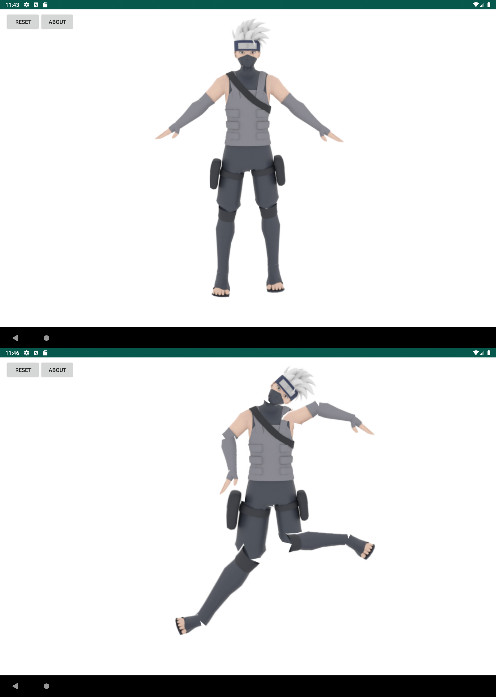

# Ragdoll
Ragdoll emulation on a Pixel C device

## Features

- Move around the character using the torso
- All other body parts can be rotated to a certain degree
- The lower and upper legs can be scaled

## Attribution

The original character image of Kakashi Hatake taken from https://s18798.pcdn.co/xyfan/wp-content/uploads/sites/7689/2018/05/kakashi3D.png
